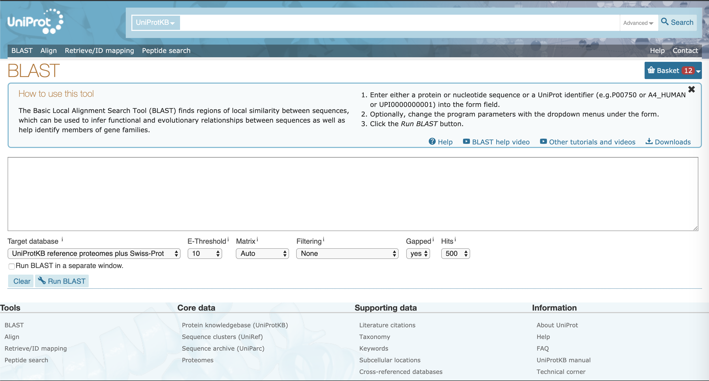

## 功能基因组学

### BLAST，序列搜索第一步

生物信息学中，`BLAST`（英语：**B**asic **L**ocal **A**lignment **S**earch **T**ool）是一个用来比对生物序列的一级结构（如不同蛋白质的氨基酸序列或不同基因的DNA序列）的算法。 已知一个包含若干序列的数据库，`BLAST`可以让你在其中寻找与其感兴趣的序列相同或类似的序列。

#### BLAST在线版，生物序列的Google

>问题：201X年，A组报道了B蛋白有降解PET（一种塑料）的活性，发了science。你很感兴趣，希望找到一个不一样的C蛋白也能水解PET，可以发AMB保毕业。
>
>流程：获取B蛋白序列，BLAST。 


1. 寻找B蛋白序列，获得的序列如下:  

此处的序列为fasta格式，一般来说，fasta格式中以`>`开头的行是序列的名称物种等信息，接下来直到下一个`>`之间的均为序列，60或80个字母为一行，但序列部分的分行不重要。  

<pre >> sp|A0A0K8P6T7|PETH_IDESA Poly(ethylene terephthalate) hydrolase 
MNFPRASRLMQAAVLGGLMAVSAAATAQTNPYARGPNPTAASLEASAGPFTVRSFTVSRPSGYGAGTVY
YPTNAGGTVGAIAIVPGYTARQSSIKWWGPRLASHGFVVITIDTNSTLDQPSSRSSQQMAALRQVASLN
GTSSSPIYGKVDTARMGVMGWSMGGGGSLISAANNPSLKAAAPQAPWDSSTNFSSVTVPTLIFACENDS
IAPVNSSALPIYDSMSRNAKQFLEINGGSHSCANSGNSNQALIGKKGVAWMKRFMDNDTRYSTFACENP
NSTRVSDFRTANCS</pre>

2. BLAST search：

  访问[NCBI BLAST](https://blast.ncbi.nlm.nih.gov/Blast.cgi)或[UniProt BLAST](https://www.uniprot.org/blast/)，一般我在搜索核酸序列时会使用NCBI，搜索蛋白序列时使用UniProt，这两个数据库其实是互联互通的。以下介绍UniProt的使用。  
  
  最上面是搜索框，对于这条蛋白序列，只要在搜索框内输入`A0A0K8P6T7`进行搜索即可获得详细的[信息](https://www.uniprot.org/uniprot/A0A0K8P6T7)。  

  将fasta格式的序列或者序列号`A0A0K8P6T7 `输入进大文本框，点击`Run BLAST`，即可运行BLAST。

| 名称            | 含义                                                         |
| --------------- | ------------------------------------------------------------ |
| Target database | 被搜索的数据库，UniProtKB referance proteomes plus Swiss-Prot是最大最全的数据库，常用的还有Swiss-Prot，是所有人工注释的序列；PDB是所有的晶体结构的序列。 |
| E-Threshold     | E值的上限，两个蛋白质序列E值越小，同源的可能性愈大。         |
| Matrix          | 打分矩阵，一般使用Auto，在输入序列存在较少同源序列，要寻找亲缘关系较远的序列时可使用BLOSUM-45，在输入序列存在较多同源序列，要寻找亲缘关系较近的序列时使用BLOSUM-80。 |
| Hits            | 返回结果的个数                                               |

输出的结果如下：

​	

在`Alignment`部分，可以在感兴趣的条目中点击`View alignment`，查看两条序列的比对情况，一般来说`Identity`大于**50%**的序列就有可能拥有相似的功能，对于发育关系较远的蛋白，比如植物合成某些代谢产物的蛋白在细菌中的同源蛋白可能相似度只有**30%**。这里我们观察一下第二个结果`A0A1W6L588` ，来自 *Rhizobacter gummiphilus* 的 DLH domain-containing protein，简称DLH。序列比对情况如下：

​	
从序列比对中，我们可以发现，DLH与PETase的底物结合位点和催化三联体均保守，推测DLH同样可以水解PET。

#### BLAST的本地版，你和菌菌的秘密花园

>问题：201X年，A组报道B菌有降解有机物C的活性，在数据库中可以查到C的降解方式，且B菌基因组已经被测序。
>
>流程：获取B菌基因组，确定降解通路中涉及蛋白质的序列，安装本地版BLAST软件，BLAST。 

---

BLAST本地版安装

访问NCBI的BLAST网站，下载可执行程序（[点击访问ftp站点](ftp://ftp.ncbi.nlm.nih.gov/blast/executables/blast+/LATEST/))  

NCBI的速度一向不行，所以我们要在服务器上先安装高速下载工具`axel`: 

```shell
sudo apt-get install axel
```

`axel` 中的` - n` 可以设置连接数，不建议过大，会导致NCBI封禁你的IP地址。 此处下载的是linux版本的BLAST 2.9.0， 支持V5数据库。

```shell
axel -n 20 ftp://ftp.ncbi.nlm.nih.gov/blast/executables/blast+/LATEST/ncbi-blast-2.9.0+-x64-linux.tar.gz
```

 解压文件：

```shell
tar -vxzf ncbi-blast-2.9.0+-x64-linux.tar.gz
```

将文件拷贝进`/opt`:

```shell
sudo cp -r ncbi-blast-2.9.0+/opt
```

添加路径至`.bashrc`文件:

```shell
vi ~/.bashrc
```

 确保键盘处于英文输入状态，按下`shift + G`，定位到文件最后一行，然后按下`o`，添加：

```shell
export PATH="$PATH:/opt/ncbi-blast-2.9.0+/bin:"
```

按下`ESC`，按住`shift`连敲两下`z`键，保存退出文件。

```shell
source ~/.bashrc
```

此时，输入`blastp -version`，回车，应当可以看见：

 >blastp: 2.9.0+  
 >
 >Package: blast 2.9.0, build Mar 11 2019 15:20:05

 代表安装成功。  

---

  1.  有报道称 *Phialophora americana* 可以降解`Zearalenone (ZEN)`，已知`ZEN lactonase (ZHD101)`的[序列](https://www.uniprot.org/uniprot/Q8NKB0.fasta)，在NCBI中可以查询到 *P. americana* 的完整[蛋白质组](ftp://ftp.ncbi.nlm.nih.gov/genomes/all/GCA/000/835/435/GCA_000835435.1_Capr_semi_CBS27337_V1/GCA_000835435.1_Capr_semi_CBS27337_V1_protein.faa.gz)。
  2.  分别下载`ZHD101`和 *P. americana* 全部蛋白质序列，分别保存为`Q8NKB0.fasta`和`Pa.fasta`。  

```shell
wget https://www.uniprot.org/uniprot/Q8NKB0.fasta
axel -n 10 ftp://ftp.ncbi.nlm.nih.gov/genomes/all/GCA/000/835/435/GCA_000835435.1_Capr_semi_CBS27337_V1/GCA_000835435.1_Capr_semi_CBS27337_V1_protein.faa.gz 
gunzip GCA_000835435.1_Capr_semi_CBS27337_V1_protein.faa.gz 
mv GCA_000835435.1_Capr_semi_CBS27337_V1_protein.faa Pa.fasta
```

  3. 建立本地 *P. americana* 数据库：  

```shell
makeblastdb -in Pa.fasta -dbtype prot -out Pa
```

  4. 运行本地BLAST:  

```shell
blastp -query Q8NKB0.fasta -db Pa > zhd101_Pa.txt
```

> 本例的现实意义在于：你的课题组筛到了菌，测了基因组，要在里面找这个蛋白序列，你不能提前上传到NCBI，只能自己本地BLAST。

### 多序列比对与进化树，今天我们都是达尔文

> 问题：对于一组序列，需要对其并观察保守位点，产生MSA (multiple sequence alignment) 文件，绘制进化树。
>
> 流程：准备fasta文件，安装muscle，产生比对文件，安装FastTree，构建进化树，[iTOL](https://itol.embl.de/)在线可视化。
>
> 需求：Ubuntu  

1. 下载一组`globin`的蛋白序列：  

``` shell
wget https://raw.githubusercontent.com/EddyRivasLab/hmmer/master/tutorial/globins45.fa
```

2. 安装`muscle`：  

```shell
sudo apt-get install muscle
```

3. 运行`muscle`产生适合观察的`CLUSTALW`格式：

```shell
muscle -in globins45.fa -out globins45.clw -clw
```

​		产生适合其他软件读取的`fasta`格式：

```shell
muscle -in globins45.fa -out globins45.ali
```

4. 下载安装`FastTree`，前面安装BLAST时，已经将 /opt/ncbi-blast-2.9.0+/bin 添入～/.bashrc：

  ```shell
  wget http://www.microbesonline.org/fasttree/FastTree
  chmod +x FastTree
  sudo cp FastTree /opt/ncbi-blast-2.9.0+/bin/
  ```

5. 构建进化树：  

```shell
FastTree globins45.ali > globins45.tree
```

6. 将`globins45.tree`文件上传至[iTOL](https://itol.embl.de/)在线可视化

### HMMER，比BLAST更进一步

>背景：之前，讨论了如何利用BLAST搜索同源蛋白。对于一个蛋白质家族，其中如果有多条实验验证过功能的序列，同时序列之间差异较大，无法选择合适的一条序列时，使用HMMER进行搜索。HMMER已经展现了比BLAST更高的准确率，正在变得更加普及。
>
>问题：糖苷水解酶是一类广泛分布的水解酶，糖苷水解酶家族非常庞大，序列复杂性非常高，纤维素酶（3.2.1.4）通常属于GH5，但是在GH11、GH45等家族中也有分布，同样的，GH5家族内也有许多酶不属于3.2.1.4。我们搜索C真菌内是否有GH5家族的纤维素酶。
>
>流程：获得C的所有蛋白质序列，构建GH5纤维素酶的隐普马尔科夫模型，使用HMMER搜索。

1. 下载C蛋白序列（和本地BLAST教程使用的是同一物种）

```shell
axel -n 10 ftp://ftp.ncbi.nlm.nih.gov/genomes/all/GCA/000/835/435/GCA_000835435.1_Capr_semi_CBS27337_V1/GCA_000835435.1_Capr_semi_CBS27337_V1_protein.faa.gz
gunzip GCA_000835435.1_Capr_semi_CBS27337_V1_protein.faa.gz 
mv GCA_000835435.1_Capr_semi_CBS27337_V1_protein.faa Pa.fasta
```

2. 安装HMMER：

```shell
sudo apt-get install hmmer
```

2. 下载GH5纤维素酶序列，这些序列是我从Swiss-Prot里下载的总共30条仅包含GH5的纤维素酶：

```shell
wget 139.224.116.102/GH5_3_2_1_4.fasta
```

3. 多序列比对：

> HMM profile的准确率严重依赖于多序列比对的正确性，而多序列比对有意义的前提在于被对齐的序列首先在高级结构上是一致的。所以我写了一个小脚本，限制序列长度的范围在平均值的（0.8, 1.2）之内。

```shell
wget 139.224.116.102/filter.py
python3 filter.py GH5_3_2_1_4.fasta GH5_3_2_1_4.fas
muscle -in GH5_3_2_1_4.fas -out GH5_3_2_1_4.ali
```

4. 构建HMM profile：

```shell
hmmbuild GH5_3_2_1_4.hmm GH5_3_2_1_4.ali
```

5. 用HMM profile给序列打分：

```shell
hmmsearch GH5_3_2_1_4.hmm Pa.fasta
```

对于*P. americana* 似乎没有明显的属于GH5的cellulase。`P10477`没有包含在过滤之后建HMM的序列里，因为长度太长了，`GH5_3_2_1_4.hmm`对`P10477`打分为`327.8`。下图为hmmsearch结果：


#### HMM简介


### InterproScan，更大更全

[InterPro](https://www.ebi.ac.uk/interpro/search/sequence/)通过将蛋白质分类为家族并预测域和重要位点来提供蛋白质的功能分析。 InterPro结合所有权威的数据库包括pfam，cdd，gene3d，prosite等15个数据库，非常适合预测蛋白质的结构域。


### 对一条蛋白质序列进行手动注释

> 背景：在HMMER的例子中，我们发现了` KIW72333.1`这条机器注释为hypothetical protein的序列，下面我们介绍一下怎么样使用这几个数据库和软件完成注释。
>
> 问题：对于一条测序得到的蛋白序列，使用生信手段初步预测其大致功能。
>
> 流程：结合BLAST、HMMER和InterPro，推测其生物学功能。

1. 获取序列` KIW72333.1`：

```html
>KIW72333.1 hypothetical protein PV04_00533 [Phialophora americana]
MATGILKVKGTQVVGNDGKPVILRGCAIGGWLNMENFIVGYPGHESSIRAAMLAAMGQENYDFFFDRWLYYFFTEADAKF
FKSMGLNCIRIPFNYRHFEDDMNPRVLKESGFKHLDRVIDLCAKEGIYTILDMHTVPGGQGPGWHADNTTSYAAFWDYKD
HQDRTVWLWEQLAQRYKGNPWIAGYNPINEPCDPKHVRLPAFYARFEKAIRAIDPDHILWLDGNTFAAEWKGFDTVLPNC
VYALHDYSMMGFPTGRPYEGTAEQKERLERQFLRKSEFQRTHNTAIWNGEFGPVYANPKWDENAEEVNQKRYNMLGEQLR
IYDKFQIPWSIWLWKDVGLQGMVYTSPDSAWNKLIEPILEKKKRLQLDAWGKYPSKEVEDLIQPLVSWIDSVSPTAKDVY
PSTWNTARHIERQVLQTFLAETFCQEFAELFRDKDQAALEELAKSFSFENCVQRDGLNKIMSDYAAIATSSGGK
```

2. BLAST搜索Swiss-Prot数据库

发现其与一个木糖酶（3.2.1.37）`W8QRE4`有极高的同源性，且此木聚糖酶属于GH5家族且没有纤维素酶（3.2.1.4）活性。

3. InterPro搜索

发现其被注释为GH5家族，GH5家族常见纤维素酶（3.2.1.4）

4. 本地HMM搜索

发现` KIW72333.1`与GH5的纤维素酶相似度不高，和`W8QRE4`与GH5的纤维素酶相似度相仿。


5. 推测，` KIW72333.1`有可能是一个少见的属于GH5家族的木聚糖酶，有可能广泛存在着属于GH5的木聚糖酶，下面的思路是可以分析一下整个GH5家族其他的蛋白序列，看看有没有不明显属于纤维素酶但和木聚糖酶比较相似的。
